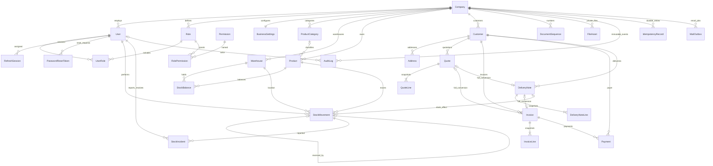

# Architecture and data integrity

## System boundary

AS TINO Stock is a modular monolith. One Nest API owns database writes; Next calls the versioned REST API. A company is selected at deployment by `COMPANY_SLUG`. Users cannot supply a company identifier to switch tenant after login. Tables retain `companyId` and cross-tenant reference triggers, so multiple companies can coexist in the database without a schema rewrite; tenant onboarding, custom domains and billing are not part of v1.

One default warehouse is seeded, with explicit warehouse selection in stock and delivery operations. No reservation, transfer, batch/lot, serial-number or expiry-date model is promised in this release.

## Entity relationship diagram

Line product references are optional; descriptive service lines can appear on documents without stock effects. `FileAsset` metadata references document kind/id or an uploaded image; the bytes live in a private S3 bucket. Company and Product can reference an immutable image asset. The exact schema is `packages/database/prisma/schema.prisma` (29 models).

## Transaction and lock ordering

A critical request is validated before its transaction. `MutationService` obtains a PostgreSQL advisory transaction lock for company + idempotency key, then checks a durable record containing actor, scope, canonical request hash and JSON response. A changed body, actor or operation with the same key is a conflict, not a second mutation. Records are not an expiring Redis cache. Responses are reserialized against current permissions where a retry might otherwise expose financial product fields.

Stock operations read-lock settings, product and warehouse, create a zero balance if needed, then lock the exact `(productId, warehouseId)` balance using `FOR UPDATE`. Quantity validation, balance change, append-only movement, audit and idempotency response are committed together. Concurrent withdrawals therefore serialize on the contested balance. The API uses Read Committed plus explicit locks, not a non-transactional read-then-update.

Commercial lifecycle changes take a company-scoped advisory lock and the source document row lock. This intentionally trades some write throughput for simpler correctness in an SME system. Invoice payments lock their invoice. Multi-product delivery effects are applied in deterministic product order and committed with the delivery status; a shortage rolls back all lines and numbering. Corrections lock the source movement and create the opposite delta with a unique reversal relation.

The integrity migration adds cross-tenant checks, immutable history, issued-header/line protections, constrained quantities, exact line/header totals, deferred ledger reconciliation, invoice/payment reconciliation and delivery/stock reconciliation. The application role cannot update/delete immutable tables. The database owner can still bypass controls and must be restricted operationally.

**Performance trade-off:** ledger consistency checks sum history for the product/warehouse. This is conservative but must be load-tested at the client's expected transaction volume. Do not remove the check casually; use an audited reconciliation/partitioning design if it becomes a bottleneck.

## Exact arithmetic policy

API money and quantity values are decimal strings. `packages/shared/src/money.ts` parses to scaled `BigInt`; no JavaScript binary floating-point value determines accounting results. Database money/quantity uses `numeric(14,3)`, rates `numeric(5,2)`. Values exceeding field precision fail explicitly.

1. Round quantity × unit price to millimes, half away from zero (inputs here are nonnegative).
2. Round each line's percentage discount to millimes.
3. Round the whole-document discount on the sum of discounted line bases.
4. Distribute that discount over lines using proportional integer allocation and largest remainders, breaking ties by line order, so allocations sum exactly.
5. Calculate and round each line's tax on its final taxable base.
6. Header subtotal, discount, tax and grand total are sums of the corresponding rounded line amounts. Tax is **not** a weighted average of line tax amounts.
7. Payment balance is issued total minus non-cancelled payments. Reject overpayment atomically.

Numbers may be converted to browser chart coordinates for visualization, never for posted accounting arithmetic. The policy must be validated by the accountant for the actual business.

## Commercial lifecycle and snapshots

Drafts have internal identifiers and no official number. Issuance/confirmation atomically increments a unique `(companyId, type, year)` sequence and assigns its configured prefix. The year is determined in the company timezone. A prefix is frozen in its existing year's sequence, preventing accidental renumbering. Numbers are never reused after cancellation.

At issuance, document lines, rates, totals, dates, branding and customer addresses are frozen as JSON plus SHA-256. Normal product/customer/settings edits cannot change the issued PDF. Original bytes are created with conditional S3 writes and immutable metadata; subsequent requests retrieve and verify the stored checksum. The original PDF reflects payments **at issue time**, not today's live balance. Current payment state is shown separately in the UI. Cancelled PDFs can carry an explicit cancellation marking while the original remains accessible.

Quotation expiry and invoice overdue are derived at read time, avoiding a cron job that must rewrite financial history. Full-document conversions use source uniqueness constraints and return the existing conversion when requested again. Partial fulfilment/invoicing and statutory credit notes are not implemented.

## Runtime responsibilities

Redis holds rate-limiting counters, not stock truth or financial transactions. PostgreSQL is the source of truth. Document email uses an outbox row created transactionally and a polling worker with `SKIP LOCKED`, leases and retries. SMTP delivery is at-least-once: a crash after SMTP acceptance but before acknowledging the outbox can duplicate email. A deterministic Message-ID helps recipients but does not prove exactly-once delivery.

PDF rendering is bounded to two concurrent Chromium jobs per API process, blocks external network access and JavaScript in the rendered page, and has a timeout. It is not a CPU-heavy independent microservice. PWA caches only public offline/static assets, not authenticated HTML or API data; mutations require connectivity.
